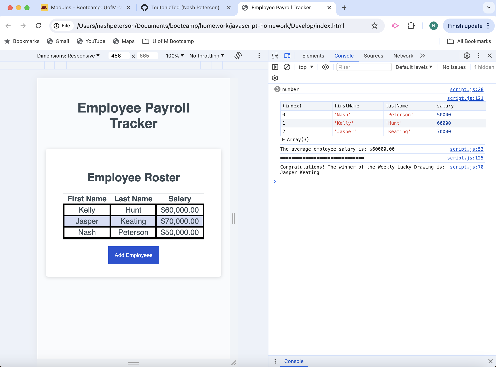

# 03 JavaScript Homework

For this assignment, I adjusted the javascript to allow functionality in the following areas of the "Employee Tracker" table:

----EVENT LISTENER---
- Added an Event Listener to the "Add Employees" button

----COLLECT EMPLOYEES----
- Defined a global object for "employees" using the following elements:
    - firstName
    - lastName
    - salary
- Created a while loop to generate prompts for users to continually add employees into the table and push the data into the empty newTableRow array.
- Used an addMore confirm to allow the user to select whether they want to add more employees or not.

----AVERAGE SALARY----
- Calculated the displayAverageSalary function:
    - used a for loop to reference the employee array
    - defined the total salary, expressed as an integer and an operation where every new entry to add to the totalSalary
    - defined the averageSalary in an expression
    - console logged the result inside javascript as a template literal to express a message besides the calculated averageSalary.

----RANDOM EMPLOYEE-----
- converted a getRandomNumber function to utilize the employees array. 
- created a getRandomEmployee function, utizing the employees array, in order to generate a random employee index from employees.length.
- console logged the result as a template literal expression, utilizing the firstName & lastName index numbers from the employees array.

## Link to Deployed Version

[Click here to see the deployed version](https://teutonicted.github.io/javascript-homework/)

## Screenshot of the Deployed Version

